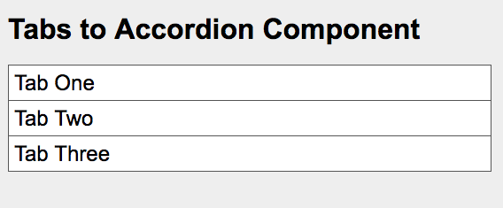

# Tabs to Accordion Component

A tabs (larger screens) to accordion (smaller screens) reusable component.

Based on/influenced by this CodePen: https://codepen.io/mpiotrowicz/pen/gocmu


## Status/Notes

The current version of this component can be seen here:
[https://caltemose.github.io/tabs-to-accordion/](https://caltemose.github.io/tabs-to-accordion/)

This component has not yet been fully tested for browser compatibility and for accessibility. Those testing efforts are forthcoming. 


## Goals for Refactoring

- ~~ES6 syntax~~
- ~~Ditch jQuery dependency~~
- ~~No template embedded in the Javascript~~
- ~~CSS updated to follow SuitCSS (probably)~~
- refactor the naming convention (CSS classes and JS functions) to be a little simpler and clearer
- WCAG 2.0 compliant (not sure what level yet)
- Use module builder instead of attaching to window cause that's a bit dumb
- Add a class to selected tab nav &lt;li&gt; elements so they can be styled according to state (this will allow the border to be on the &lt;li&gt; in the cases where it might be desirable to hide the bottom border on selected tab buttons)


## Possible Improvements

- More config data passed through constructor/options (scroll on/off and amount, etc)
- Options for extra tab markup (for larger screens) to be generated client-side (maybe, might not do this)


## Notes About Troublesome Features

There are a few features that are disabled by default or I chose to omit entirely after exploring potential solutions. They are described below.

### Completely Closing the Accordion

The original CodePen example for this code did not allow the accordion to be completely collapsed. By completely collapsed I mean this:



After implementing the feature, I realized one reason why the original developer may not have added this feature: when the accordion is completely collapsed and the user changes the window size to switch the component from accordion mode to tabs mode, there will be no visible tab content which is not a desireable behavior of a tab system.

In this case, I have included this behavior in my version of the component but it is disabled by default.


### Consistent Tab Height

Enforcing a consistent tab height across all tabs prevents the page from wiggling when the user changes tabs and the newly-visible tab content is a different height than the previously-visible tab content. 

I experimented with handling this in Javascript but it became clear that for me, the best way to enforce consistent tab height is through the CSS and breakpoints and is best left to the developer using this component. Read on if you want to know why.

There are two primary reasons why I removed my test code that normalized the tab content height. The first reason is the most significant. In order to set the tab content elements uniformly, on initialization the heights of all tab content elements must be checked to determine the biggest one and then the heights of all tab content elements are set to that maximum height. The problem with this is that in order to determine the tab content element heights, each element cannot be hidden using `display: none` - they must be hidden with something like `visibility: hidden`. Since this is not normally a desirable way to hide content, the Javascript must temporarily style the tab content elements so they can be measured and then reset their styles back to the default. For example, I used this styling to be able to measure the tab content elements:

```
position: fixed !important
left: -9999px !important
display: inline !important
visibility: hidden
```

[See here for a discussion of this technique.](https://stackoverflow.com/questions/19172545/how-to-get-hidden-element-height)

The problem with this is that the content element is no longer width-constrained by its parent container which means that while it now has a height greater than zero, that height is not the same as when the element is visible and width-constrained by its parent.

While it is possible to overcome this, it became clear that because this tab component could live in containers styled a variety of ways, it wouldn't be possible to overcome this issue in all possible cases and it would require a pretty significant level of attention by the implementing developer to ensure that this dynamic height-setting behavior worked correctly.

The second issue is less significant but still one I prefer to avoid. In order to make this dynamic height setting appropriately bulletproof, there needs to be a window resize listener that would call this functionality any time the window was resized since it's possible that with the resize, the heights of the tab elements could change, especially in a fluid layout. This isn't the end of the world but a situation I prefer to avoid when possible.

Since adding this dynamic height-setting code does add bulk to this component, and it would be optional functionality (probably disabled by default), I chose to remove it and leave this normalization of tab content heights to developers who choose to use this component.


